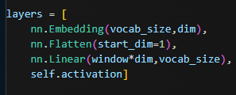
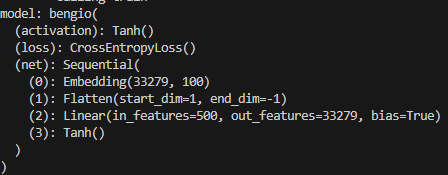
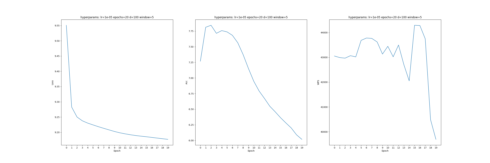
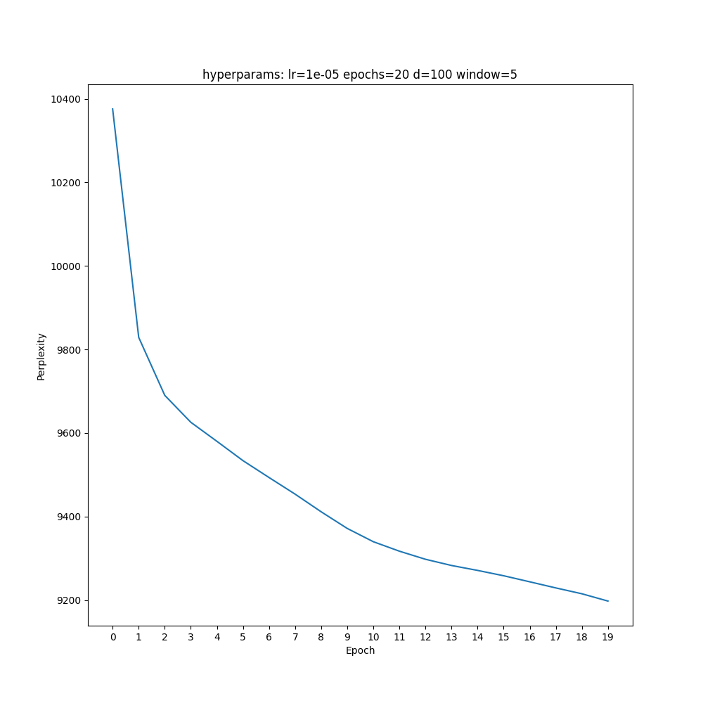
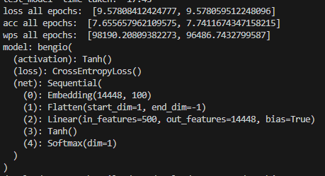
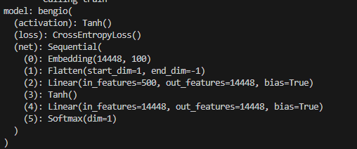
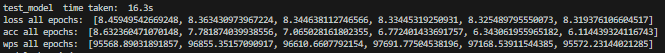
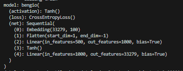
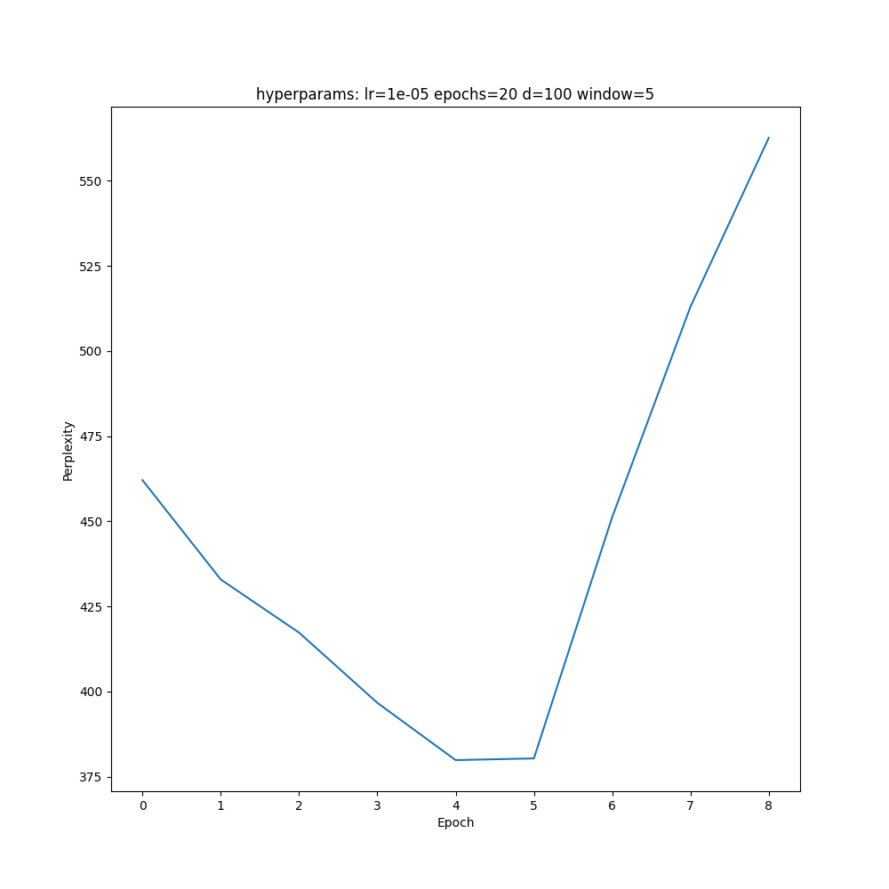
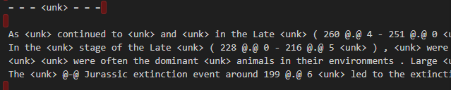

# Results for Sebastian Phemister

## Step 1

The microarchitecture for this model is very similar to the handout's description of the model, where it uses a lut to find the 100 element embedding for each word in the model. I used a sliding window of 5, because I found that it gave a good trade off between context and complexity for the model (requiring 5 minutes to train an epoch).

### Microarchitecture



### Microarchitecture Nodes



I needed to flatten out the tensor after getting the embedding for each word, as 5 words each getting their 100 feature embedding made the input into the hidden layer added up to 500 features. I used the layers functionality because it forced me to program everything for the GPU, which ended up being the bottleneck for the entire model.

I was a little bit disappointed with the output of the model, as the threshold that I chose (3) was clearly too small for the model, as there were 33k words represented in the corpus with most of the model not being able to understand the natural language.

### Loss and Accuracy



### Perplexity



A perplexity of 9000 is not the greatest, seeing that the probability of one token appearing in the dataset is 1/33279, and this model is only 4 times better than random guessing. So I tried to improve the model multiple times.

I tried to increase the threshold to be 100, to decrease the perplexity of the model, however this lead to lukewarm results



Lastly, I tried to change the number of hidden layers and include another layer in order to help the model learn the hypothesis function better.





The more that we train the model, the less accurate the model gets and starts to over fit on the data that it already has. Which given the current outputs of the model, is a little lackluster. Reducing the number of words does actually help the accuracy of the model by reducing the number of possible words given a context window. I tried one last micro architecture





This microarchitecture seems to do an okay job at the task, where it seems to overfit on the training data after epoch 5. So I used that epoch to testbench the model and it seems to do an okay job, with the most common outputs just being the most common words in the dataset (unk, , , by, the, of, the, their, this, those, and, is, but). **HOWEVER, IT GETS 10X THE PERFORMANCE AS THE INTIAL MODEL, SO WE ARE KEEPING IT**

## Step 2

1. Variables:
   1. Vocab: list of all unique words in the dataset
   2. Words: lut for str word to word id and freq
   3. Rev Words: Seb defined lut for word id to the str representation
   4. train: continuous list of all word ints in the dataset for traingin the model
   5. test: continuous list of all word ints in the dataset for testing the perplexity and accuracy of the model
   6. valid: continuous list of all word ints in the dataset for testing the configurationn of hyperparamters
2. The perplexity of the model before starting training is close to the corpus size. This makes sense because the model is randomly guessing for each of the words, and given the formula for perplexity is: $perplexity=exp\left( -\frac{1}{N} \sum_{n=0}^{N} ln\left( p_{n} \right) \right)$ If each word has equal chance to occur, then you will get back the corpus size as the perplexity
3. The perplexity goes down and the accuracy goes up, as there are less words present in the dataset. However, this makes your model have a lower intelligence because it cannot completely understand or express natural language. The speed of the model also increases because the embedding space and output vector is smaller, leading to a smaller number of weights to update in the n^3 matrix multiply instruction.
4. A window size of 3 will make training speed up, as the hidden layers will have a smaller number of input indicies, leading to a smaller matrix to store in memory and perform calculations on. In theory, with infinite training data, both models will be identical because every word combination possible will be mapped at its relevant frequency. In larger datasets, a window size of 5 will perform better because it has more context about the next word, however, on smaller datasets, 3 will perform better because it can memorize the training dataset. From my experiments, a sliding window of 5 performs slightly better in accuracy than 3 with the wiki text training dataset
5. I would:
   - make sure that all of the words present in the test and valid datasets are present in the main corpus
   - Remove all of the whitespaces and delimiter tokens between sentences
     - In all of the sentence titles, theres the equals sign to delimit the title, with each subsequent title adding another equals before and after the title. This adds unnecessary noise before and after the Titles, which only increases the perplexity of the model.
   - Remove all non Unicode characters from the dataset
     - In the test dataset, there is raw Japanese text that I emailed David about, requiring the user to open the file in utf-8 if theyre using windows
       - This adds unnecessary noise to the model, which at a threshold of 20, will get put into the unk token
   - Clean up the dataset
     - This is less simple, as it would require manually combing through the data
     - but if you look at some of the sentences, it is hard to read them, even as a human.



### Part 3

These are the first four examples from the examples.txt dataset

```text
Example setnence perplexity
Input sentence:          The game began development in 2010 , carrying over a large portion of the work done on Valkyria Chronicles II . While it retained the standard features of the series , it also underwent multiple adjustments , such as making the game more <unk> for series newcomers .
Reconstructed sentence:  <unk> <unk> of to to the . and , the <unk> @-@ of the <unk> of . the 's , , The the was the <unk> of of the <unk> , the was a the <unk> . and as the a first , than , the . .
Perplexity: 393.6

Input sentence:          Its story was darker and more somber than that of its predecessor . The majority of material created for previous games , such as the <unk> system and the design of maps , was carried over .
Reconstructed sentence:  <unk> , , <unk> by the than . the the the own .  first of the and in the years . and as the <unk> <unk> , the <unk> of the . and released in the
Perplexity: 291.7

Input sentence:          This was followed by a starring role in the play Herons written by Simon Stephens , which was performed in 2001 at the Royal Court Theatre . He portrayed an emergency physician applying for a medical <unk> .
Reconstructed sentence:  <unk> <unk> a by the <unk> of of the <unk> of , . the to , and was a in the , the time @-@ of .  also to <unk> to in to the new of ,
Perplexity: 463.5

Input sentence:          In 1948 , <unk> was drafted by the Philadelphia Eagles in the 15th round of the NFL draft , and he was also drafted by the New York Yankees of the All @-@ America Football Conference .
Reconstructed sentence:  <unk> <unk> , and , a to the <unk> of , the United of , the <unk> . , and the was not to to the <unk> York , , the <unk> @-@ year @-@ League to The
Perplexity: 229.1
```

We can see that the model has some ideas, where it can kind of understand whats being asked and thinks that transitional words need to be put everywhere inside of the sentence. In addition, there is relatively low perplexity in the model, as it is data the model has seen and therefore already has some idea of the idea that its trying to convey.

These are the sentences from wikipedia:

```text
Input sentence:          Albert Einstein ; 14 March 1879 - 18 April 1955 was a German - born theoretical physicist who is best known for developing the theory of relativity .
Reconstructed sentence:  <unk> <unk> , <unk> @-@ <unk> , the , and , not first of , , , , had a to as the , <unk> , the ,
Perplexity: 3271.9

Input sentence:          Large language models , currently their most advanced form , are a combination of larger <unk> <unk> using words <unk> from the public <unk> , <unk> neural networks , and <unk> . They have superseded recurrent neural <unk> models , which had previously superseded the pure statistical models , such as word <unk> language model .
Reconstructed sentence:  <unk> <unk> , , the , <unk> of of of and known <unk> of the . and , <unk> , , the <unk> , , which , , , and the ,  were been that and <unk> , , the was been a and <unk> of of , the as the , , , ,
Perplexity: 856.6
```

Whenever the model hits words that it has never seen before, its very difficuilt for the model to gain any valuable information from the context. Whenever it's not given enough information from the context, it decides that the best course of action is to just retrun the unk token, as unk's have a high probaility of being next to each other. However, if it sees the name Albert a thousand times in the training data, theres a high likelyhood that a normal human would say Einstein and it would become programmed to say Einstein. In summary, any data outside of the training data is an absolute mess.

Voice dialog:

```text
Input sentence:          Voice : What happened ? Han Solo : [ getting nervous ] <unk> we had a slight weapons <unk> , but uh . . . everything 's perfectly all right now . We ' re fine . We ' re all fine here now , thank you . How are you ? Voice : We ' re sending a squad up . Han Solo : Uh , uh . . . negative , negative . We had a reactor leak here now . Give us a few minutes to lock it down . Large leak , very dangerous . Voice : 
Who is this ? What 's your operating number ?
Reconstructed sentence:  <unk> ,  , , <unk> , ,  the ] , that , , been <unk> of of in and the to The  The , <unk> , the , ,  was , @-@ , The was first @-@ the . . <unk> the , , The , also to , ,  , , @-@ , " of to  , ,  , and , The  The was the ,  was been been of , , known The was the <unk> years . the the , to The 's that the <unk> ,  ,  , a to " of <unk> of , of
Perplexity: 3063.6

Input sentence:          <unk> : This is your last chance . After this , there is no turning back . You take the blue pill - the story ends , you wake up in your bed and believe whatever you want to believe . You take the red pill - you stay in Wonderland and I show you how deep the <unk> hole goes .
Reconstructed sentence:  <unk> <unk> <unk> <unk> a <unk> to of  the time the was a @.@ of to  is 't <unk> of on the <unk> of , the in of the the , , the . the to . the the  , the <unk> , , the . , the , the . . . the the <unk> of . .
Perplexity: 972.5
```

The model has never seen dialog before and therefore doesnt really understand spoken text transformed into written text. The translation mixed with ..., multiple people speaking on the same line seems to confuse the AI and doesnt really give it a direction to go whenever it's context window is just Han Solo : [ getting.


High Unk Molarity

```text
Input sentence:          The Large <unk> <unk> <unk> ) is the world 's largest and <unk> particle <unk> . It was built  <unk> <unk> <unk>  <unk> for  <unk> <unk> <unk> ) between  <unk> and  <unk> in collaboration with over  <unk> , <unk> scientists and hundreds of universities and laboratories across  <unk> <unk> <unk> <unk> .
Reconstructed sentence:  <unk> <unk> <unk> , <unk> <unk> , a <unk> of <unk> . the <unk> . <unk>  is also by  , <unk> ,  <unk> the  , , , , the  and <unk>  , the , the the  , and , , <unk> @-@ the . the . the  , , , (
Perplexity: 205.9

sent_int:  [10, 10, 10, 10, 14, 10, 17, 10, 23, 210, 10, 14, 18, 10, 10, 153, 14, 18, 14, 18, 38, 18, 18, 10, 14, 18, 14, 1, 14, 17, 14, 132, 18, 14, 18, 16, 14, 10, 10, 14, 10, 10, 10]
Input sentence:          <unk> : One day the <unk> are going to <unk> <unk> on us the same way we look at fossil skeletons on the <unk> of <unk> . An upright <unk> living in dust with crude <unk> and <unk> <unk> <unk> <unk> extinction .
Reconstructed sentence:  <unk> <unk> <unk> <unk> , <unk> of <unk> to be <unk> , the <unk> <unk> year , the , the and the the <unk> , the ,  , of , was the , the . , <unk> <unk> , <unk> <unk> <unk>
Perplexity: 283.1
```

Technically, this has the highest performance of the model because of the aforementioned rule that "unks follow unks follow unks...", so it gives us very low perplexity since it is very certain that there is going to be a lot of UNKs. Now, give this to a human and they truly have no idea what is going on with the model.
