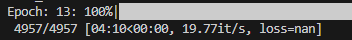
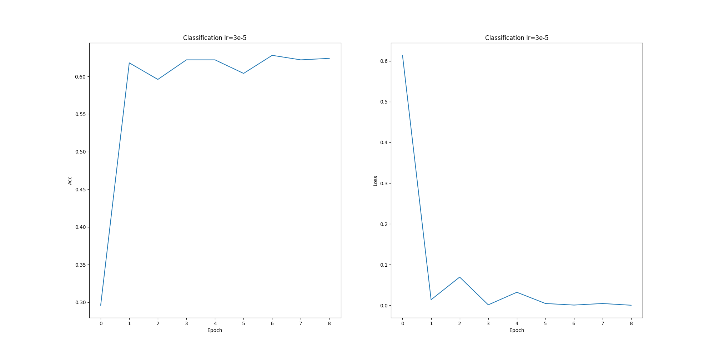
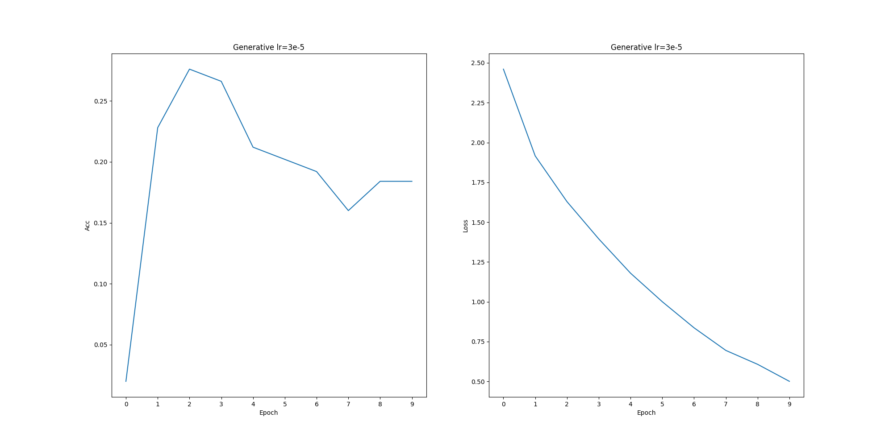

# Report

## Guide

`q1.py` is the classification approach
`q2.py` is the generative approach

## Q1

THIS CLASS CANNOT HOLD ME BACK IM THE GREATEST MACHINE LEARNING ENGINEER TO EVER EXIST (this is the first time I have out performed demeter's models please let me have my moment).
Initially, on zero shot testing, I was getting 29% accuracy, but after training for one epoch, I was getting around 3% accuracy on the model for some random reason.

I tried multiple different ideas to fix the accuracy of the model:
    - One of the theories that I had was that the cross entropy wasn't working
      - To solve this, I tried to roll my own loss function for training the model, so I could be sure that the model was being trained on the correct values. This didn't help, as it was giving me basically the same results
    - I also tried to remove the model's ability to change it's parameters with
      - with torch.no_grad():; preds = model(**encoded_inputs)
      - However, this only led to nothing changing inside of the model, as the encoder network is the thing that's actually learning inside of the model.
    - I tried removing softmax, but this only made the outputs completely independent of one another, leading the model to just assign wild values to the outputs to reduce the loss

That was until I realized something, I didn't inlcude the line
`optimizer.zero_grad()`

Thankfully, due to the earlier optimizations, my accuracy immediately spiked up to 60% and hovered around there

However, I faced a new issue:



My loss was so low, that it actually went to nan

So, after stopping the training and having to reconstruct the output graph manually, I got this graph:



Approach:

1. Pull Bertmodel from HF
2. tokenize the dataset with the following rules: (This makes sure that all of the context is passed into the model for each of the questions)

    ```python
    for each option:
        '[CLS] ' + result['fact1'] + ' [SEP] ' + result['question']['stem'] + ' [SEP] ' + result['question']['choices'][j]['text'] + ' [SEP]'
    ```

3. make the labels a \[n_choices\] long vector thats one hot encoded
4. forward pass through bert to get the representation of all the words
5. take the output from only the first token, as the `[CLS]` token is only there to get the 768 long vector to be passed into the linear function
6. Make a \[768 x  1\] vector that will take the output from the model and guess how "true" it thinks it is.
7. Concat all foru of these options and take softmax across the four of them. This will give you the probability of each of the answers being true.'
8. Take the negative loss lieklyhood and then run backpropogation on it.
9. Test the model via repeating 3-7 to get the probabilities of the four options
10. Take the most likely result as the chosen option from the user and use that value to evaluate the accuracy.

## Q2

I was a little bit suprised that this model performed as well as it did, where it gets to around 20-25% accuracy, even the entire English language at it's disposal.
For this model, I also started off with letting the model take a guess with zero training, and it averaged around 21% accuaracy. However, if you let it train for one epoch, the accuracy went to 0%, so I added two different metrics for training:

- accuracy
  - self explanatory
- letters_used
  - for every test, I wanted to see if the model would guess ANY of the four options to see if the model had some idea of what it was expected to do.

What I noticed is that after one epoch, the model not only had 0 accuracy, but it also had 0% letter use, meaning that something else was wrong with the model.
I figured out what it was, it always generated a whitespace token betwen the `[ANS]` token, as that's what it saw during training. So, I started to give it space to generate up to 5 tokens, with the ability to yield the rest of it's tokens if it generates the `|eos|` token. What ended up happening is that the model would either:

- the letter guess and then `|eos|`, which was very rare
- generate a whitespace token, and then the letter guess
- generate a whitespace token, the `[ANS]` token agian and then the letter guess
  - I guess you can't be too sure unless you generate your own ANS token
- generate a whitespace token, the `[ANS]` token again and then absolute garbage
  - Sometimes it would be text, other times it would be an assortment of whitespace characters

Three of these are good results, but they each have different locations of the answer, so I generated my own answering scheme: Start the decode at the new tokens, and check all of the ids starting from the first generated token until the last. If it's A, B, C, or D, then take that as the guess. This method is not the most perfect, but it gets the job done for all 4 edge cases at the same time.

I also tried to remove the trailing whitespace from the testing section, so that it would receive the exact same prompt as the training up until the answer token in the model. This ended up with the model getting 0.2% accuracy after 3 training epochs, which turned out to not be the reason why the model was doing so poorly.

I could rewrite a loss function to only consider the loss from the last token, however, after two hours of trying I gave up.



Approach:

1. Pull GPT2LMHeadModel from HF
2. tokenize the dataset with the following rules: (This makes sure that all of the context is passed into the model for each of the questions)

    ```python
    for each sample:
        '[START] ' + result['fact1'] + ' [SEP] ' + result['question']['stem'] + ' [SEP] ' + "".join(f" {answers[j]} {result['question']['choices'][j]['text']} " for i in range(4)) + " [ANS]"
    ```

3. append the label for training
4. forward pass through LMgpt2 to get the logits of the previous words and newly generated values
5. run backporpogation
6. Test the model by removing all of the labels from the samples so that it generates the label after one call to model.generate()
7. Take all of the models generated tokens and get the first instance of a character. If the character is correct, add to the accuracy metric and letter metric. If the model guessed one of the character options, increment the letter metric. If there are no characters, do not increment either.
